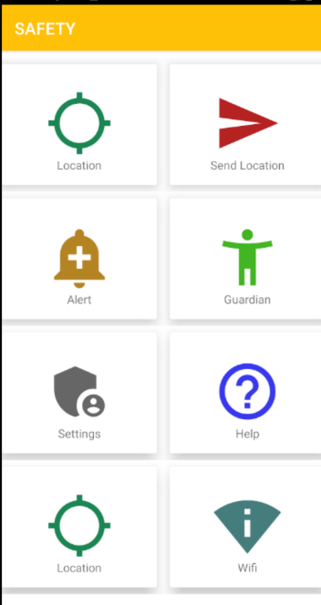
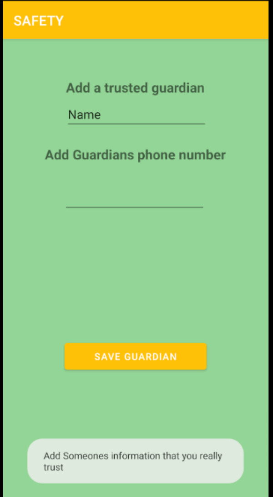
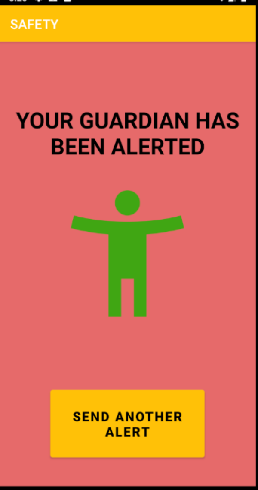
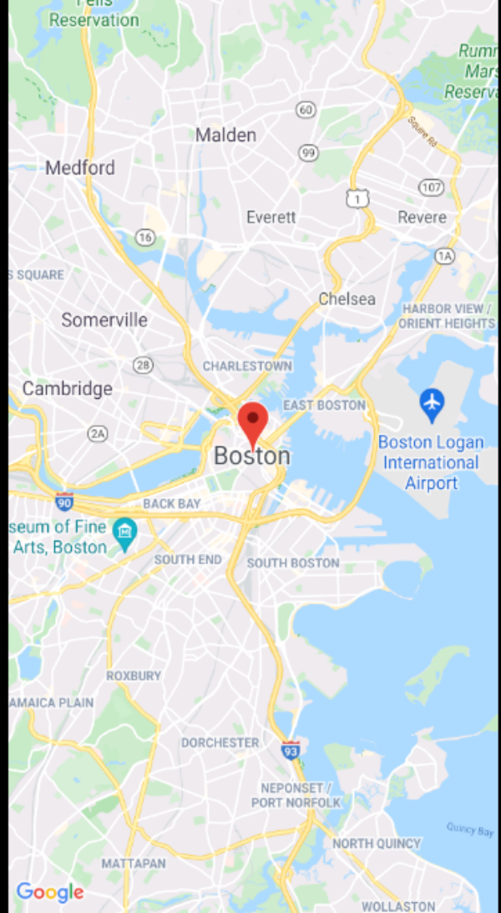

# Safety
Mobile Applications final project

# How to use
If you see the page below you are on the main page 

 

Next, you will want to navigate over to the guardian page and enter the name, phone number and email of a person that you completely trust

When you feel that you are in trouble you can tap on send location to instantly send you location to your guardian

You can view your exact location if you tap the location icon

# Project Statement

This application that I wanted to develop was an all purpose application that can help you with daily life. It quickly turned into a much simpler app because I found it to be very challenging. The purpose of my project was to build an app where someone who is in danger or in a scary situation could alert a trusted friend that they were in trouble. For example if an attractive woman is walking home alone in the dark through a dangerous neighbor, she could hit the alert button which would text a preset contact her exact location.

# Application Design

This application target mobile phones and tablets, preferably devices that people can carry around on them (Devices people would likely have on them in an emergency). This application uses google maps api to track your exact location.

<b>MainActivity</b> - The main activity defines the title and vector assets for the recycler view, it then set the recyclerviewadapter. I went with the recycler view because I was not sure how many features I wanted to add at the start. The recycler view allows you to be dynamic.

<b>RecyclerViewAdapter</b> -  The recycler view adapter is the controller for th allows the home page to be dynamic and show the tile navigation. In this page we can set onclick listeners for each tile. We check for matching titles and if the title matches we can spark a new activity or send a message.

<b>MapsActivity</b> - This activity uses the google maps api. In this activity we check if the user has trhe correct permissions. Something that is relatively new is the  onRequestPermissionsResult. We need to override this method, if the app needs to prompt the user for permission it will run the following code as a result. The code is essentially the same as in the onCreate method but this is executed if the user has to grant permission. Next, it uses location listener to recieve our current location and will display it on the map. The maps activity uses geocoder, which allows the developer to get the users address and zipcode should he/she want to add this information in another feature later on down the line.

<b>AddGuardian</b> - The add guardian activity uses textview and edittext texts to recieve the users name and phone number. I then save this information in shared preferences and will call it later to send and instant text message when the client taps on the send location icon.

<b>Vector Assets</b> - I was able to design and color some vector assets for the recycler view.

# Application Implementation

The application was built on API 28 and targeting new android devices because having the location constantly on does not drain the battery. During initial testing I could not get the recycle view to be dynamic and was stuck on this for a while. It turned out to be a design problem in my custom grid layout. The color scheme was designed to be relaxing so when the person is in a dangerous situation the color is subliminally relaxing. Right now the application does not actually send a message to someone when they hit the send location because I cannot correctly save the user information in shared preference so I am not able to extract this information. This can be fixed given more time and a little guidance. For now i have a fixed phone number in there. There is no database on the back end because we  are not saving a lot of data. This app is not to track information and store, it is for safety and this is it.

# References
I referenced the documentation and the textbook (although much of it was deprecated)
https://developer.android.com/guide

# Experience

This was a fun project although I spent the majority of the time completely lost. It was much different than the homework when we have to come up with a project from scratch. I did not know where to start. I am a little disappointed because I was hoping to make something a little more functional. I wish I took the time to learn Kotlin over the semester because most of the Android apps written in 2021 use Kotlin. I am satisfied with my progress over the semester. I worked hard and did my best so I hope that I do not get an F. Some functions that would have been nice to have would be an option to discretely alert your guardian to your dangerous situation. 

