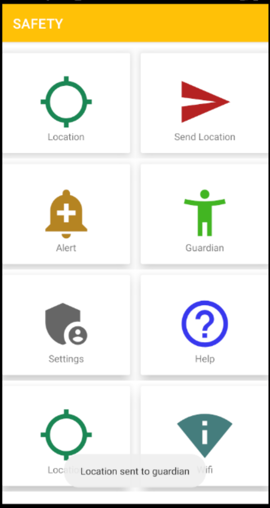

# Safety
Mobile Applications final project

# How to use
If you see the page below you are on the main page 

 

Next, you will want to navigate over to the guardian page and enter the name, phone number and email of a person that you completely trust

When you feel that you are in trouble you can tap on send location to instantly send you location to your guardian

You can view your exact location if you tap the location icon

# Project Statement

This application that I wanted to develop was an all purpose application that can help you with daily life. It quickly turned into a much simpler app because I found it to be very challenging. The purpose of my project was to build an app where someone who is in danger or in a scary situation could alert a trusted friend that they were in trouble. For example if an attractive woman is walking home alone in the dark through a dangerous neighbor, she could hit the alert button which would text a preset contact her exact location.

# Application Design

This application target mobile phones and tablets, preferably devices that people can carry around on them (Devices people would likely have on them in an emergency). This application uses google maps api to track your exact location.

